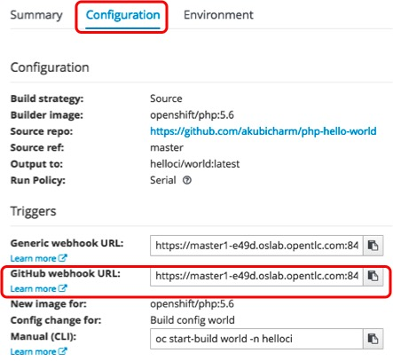

# 継続的インテグレーション

OpenShiftでは、Git リポジトリのwebhookをトリガとして、ビルド・デプロイの自動化を実現する機能がある。
ここではhello-phpのアプリケーションを利用して、継続的インテグレーションを実施します。

## Git プロジェクトの準備
1. https://github.com/akubicharm/php-hello-world をフォーク

## アプリケーションのビルドとデプロイ
### プロジェクトの作成
1. 管理Webにログイン  
`https://<利用環境のURL>:8443`にアクセス。

2. プロジェクトの作成  
「New Project」ボタンをクリックして、プロジェクト作成ウィザートを開始。

3. プロジェクト名の設定  
「New Project」画面でNameフィールドに「helloci」と入力し、「Create」ボタンをクリック。

### PHPアプリケーションのビルドとデプロイ
1. PHPの選択  
テンプレート一覧から「php:5.x - Latest」を選択。

2. Pod作成  
Nameフィールドに「world」、Git Repository URLに「https://github.com/[YOUR_ACCOUNT]/php-hello-world」と入力し「Create」ボタンをクリック

3. ビルドとデプロイの確認  
「Next Steps」画面で`Continue to overview`のリンクをクリック。

4. ビルドログ確認  
「View Log」のリンクをクリックし、ビルドログを確認。

### Webhook URLの確認

1. BuildConfig の選択
左側のPaneから「Builds > Builds」を選択
BuildConfigの一覧から「Wolrd」というBuildConfigを選択

2. WebhookURLの確認
右側のPaneで「Configuration」タブを表示し、「GitHub webhook URL」をコピー  

### Githubの設定

1. 「settings」タブを選択
2. 「Webhooks」を選択
3. 「Add webhook」ボタンをクリック
4. 「Payload URL」に、コピーしておいたOpenShiftのGitHub webhook URL を貼り付け
5. 「Disable SSL Verification」ボタンをクリック
6. 「Add webhook」ボタンをクリック

### ソースコードの更新
1. 管理WebでOverviewの表示
変更の反映が目視できるように、hellociプロジェクトのoverviewを表示
2. index.php を編集
3. 変更をコミット
