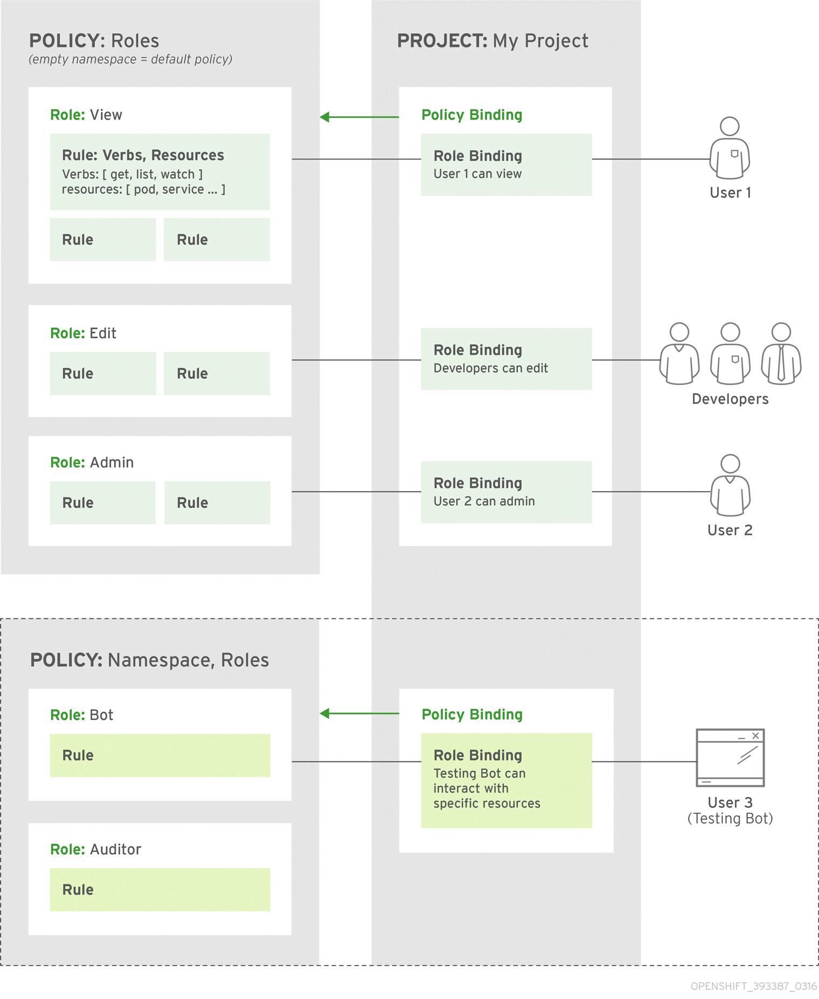

# 権限管理


* Rule
  + 何ができるかの定義
* Role
  + ルールの集合
* Bindings
  + Roleの紐付け
* Policy  
  ユーザがProject内で何ができるかを許可する仕組み。
    + Cluster policy  
    全プロジェクトを対象としたポリシーで、Cluster rolesを割り当てる
    + Local policy  
    特定のプロジェクトを対象としたポリシーで、Local rolesを割り当てる

**デフォルトロール一覧**

|デフォルトのRole|詳細|
|---|---|
|admin|プロジェクトの管理権限。プロジェクトないのすべてのリソースにアクセス可能|
|basic-user|プロジェクトやユーザの情報を参照可能|
|edit|project内のリソース編集の権限。ただし、role や bindingsの参照と編集は不可|
|self-provisioner|プロジェクトの作成権限。ユーザにプロジェクト作成をさせたくない場合は、一般ユーザからこの権限を剥奪する|
|view|参照権限。プロジェクト内のオブジェクトを参照可能。ただし、role やbindingsの参照は不可|
|cluster-admin|OpenShiftそのもののスーパーユーザ|
|cluster-status|OpenShiftのクラスタステータスの参照権限|


## Service Account
OpenShiftのAPIへのアクセスをコントロールするためのオブジェクト。各プロジェクトにはデフォルトで以下のサービスアカウントが作成される。
通常のユーザと同様にpolicyによって権限を付与することが可能。
Service Accountは、プロジェクト名とユーザー名で構成される。

system:serviceaccount:<プロジェクト名>:<名前>


|Service Account|使い方|
|---|---|
|builder|Podのビルドをするためのサービスアカウント。systme:image-builder の権限を持ち、OpenShift内部でもっているDockerレジストリに生成したDocker Imageをpushする|
|deployer|Podをデプロイするためのサービスアカウント。system:deployerの権限をもち、Replication ControllerやPodを参照、編集することが可能。|
|default|builder,deployer以外のすべての捜査が可能なサービスアカウント|

## Security Context Constraints (SCCs)
Podの権限を管理するための仕組み。
Container のプロセスをどのユーザで実行するか、永続化ストレージが利用可能かなどを管理することが可能。

cluster administrator, nodes, build controller は、priviledged SCC にアクセスすることが可能。認証された（ログイン済みの）一般ユーザは、restricted SCC にアクセス可能。

* priviledged SCC（特権コンテナを実行するためのSCC)
 + 特権を持つ Pod の実行が可能
 + コンテナを実行しているホストのリソースを利用できる
 + ホストのボリュームのマウントなど、ホストサーバのリソースを利用可能
   - MCS = Multi-Category Security
     - OpenShiftでは、同一プロジェクト内のコンテナプロセスには同じMCSのラベルが付与されており、リソースを共有することが可能となっている。
   - PIC = Interprocess communication プロセス間通信
* Restricted SCC (制限されたコンテナを実行するためのSCC)
 + 特権コンテナとしては実行負荷
 + 決められたUIDの範囲内でPodは実行される


## SCCの確認と適用
### 登録済み SCC の確認方法
```
oc get scc
```

### ユーザーやグループへのSCCの適用
特定のユーザーやグループに、特権Podを作成する権限を与える場合は、次のように設定する。
```
oadm policy add-scc-to-user <scc-name> <user-name>
oadm policy add-scc-to-group <scc-name> <group-name>
```

**例）special-user に特権Podを作成する権限を与える場合***
```
oadm policy add-scc-to-user priviledged special-user
```

### サービスアカウントへのSCCの適用
```
oadm policy add-scc-to-user priviledged system:serviceaccount:<プロジェクト名>:<サービスアカウント名>
```

**例）myprojectプロジェクトのmysvcにsccを適用する場合***
```
oadm policy add-scc-to-user priviledged system:serviceaccount:myproject:mysvc
```

### 外部のリポジトリからダウンロードしたDocker　Image を実行可能にする

OpenShiftでは、コンテナ内のプロセスは一般ユーザ(UID=1001)で実行される。

認証済み（OpenShiftにログインしている）ユーザ全員に許可する場合

```
oadm policy add-scc-to-group anyuid:authenticated
```

特定のプロジェクトに許可する場合
```
oadm policy add-scc-to-user anyuid system:serviceaccont:myproject
```
