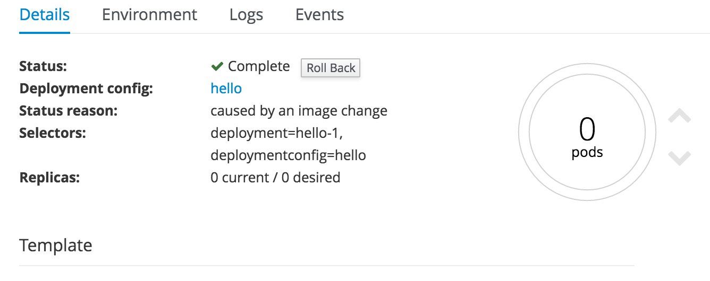

# アプリケーションの世代管理

[continuousIntegration](../continuousIntegration/continuousIntegration.md)　を参照して、アプリケーションをデプロイ。


## 環境変数の設定
ロールバックが利用するコンテナイメージだけではなく、デプロイ時に設定した環境変数などを含むロールバックであることw理解するため、Deployment Config に環境変数を設定する。

1. Deployment の選択
左側の Pane で Applications -> Deployments を選択し、Deployment 一覧を表示。「hello」を選択し、Deployment の詳細を表示

2. 環境変数の設定
右側の Pane の詳細画面で「Environment」タブを選択し、環境変数を設定し、「Save」ボタンをクリック

|Name|Value|
|---|---|
|GREETINGS|Hello|

## ロールバックの設定

1. Deployment Config の表示
左側のPaneから Application -> Deployments を選択し、表示された Deployments の一覧から「hello」を選択。


2. Rollback 対象のバージョンの Deployment Config を選択
Deployment Config の詳細画面を下までスクロールし、ロールバック対象のバージョンの Deployment を選択


3. Rollback
「Rollback」ボタンをクリックし、ロールバックの設定のチェックボックスをチェックし、「Roll back」ボタンをクリック




4. 確認
左側のPaneで Overview を選択し、ロールバックを確認


**Caution**
ロールバックをすると、Build & Deploy のトリガーが無効になっているので、再度、有効にする必要がある


```
$ oc rollback hello --to-version=1
#5 rolled back to hello-1
Warning: the following images triggers were disabled: hello:latest
  You can re-enable them with: oc deploy hello --enable-triggers -n helloci
```
