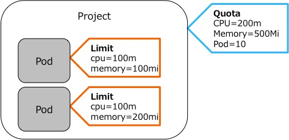

# Autoscale
Make settings to enable auto scale.

## Quota, Limit

### Quota
Hard constraints on available resource usage to set in the project.

### Limit
Required resource usage to set to Pod / Container




## Holizontal Pod Auto Scaler
HorizontalPodAutoscaler object specifies how the system shoud automatically increase or decrease the scale of a replication controller or deployment configuration, based on metrics collected from the pod that belong to that replication controller or deployment configuration.  
https://docs.openshift.com/container-platform/3.3/dev_guide/pod_autoscaling.html

## Deploying the application
1. Login to Administration Web  
Access `https://<URL of the use environment>`.

2. Create a project  
Click the "New Project" button to start the project creation wizard.

3. Set the Project Name  
On the New Project screen, enter "autoscale" in the Name field and click the "Create" button.

4. Select PHP image stream  
Select "php: 5.x - latest" from the template list.

5. Specify SCM  
Enter 'https://github.com/akubicharm/php-hello-world` as the application name in Git Repository URL and click the' Create 'button.

6. Display Deployments  
Select "Applicaation -> Deloyment" from the left side Pane, and display the Deloyment list. Click on the target Deloyment from the Deployment list.

** CPU request is required to enable autoscale **

7. Resource limit setting  
Select "Set Resource Limits" from the "Actions" pull-down menu in the upper right of the Deployments screen.

On the Resource Limits screen, enter the value of Request / Limit of CPU, Memory and click "Save" button.

| Type | Request | Limit |
|---|---|---|
| CPU | 100 m | 200 m |
| Memory | 200MiB | 400MiB |

8. Setup the auto scaler  
Select "Add Autoscaler" from the "Actions" pull-down menu in the upper right of the Deployments screen.

On the Autoscale deployments setting screen, set the parameters and click the "Save" button.

| Parameter | Value |
|---|---|
| Autoscaler Name | (as default) |
| Min Pods | 1 |
| Max Pods | 4 |
| CPU Request Target | 10 |


## Experiment with autoscale
Access the application created from the client and confirm that it scales out.

```
Import threading, time, urllib 2

Def getHtml (url):
    Response = urllib2.urlopen (url)
    Html = response.read ()
    Print (html)

AppUrl = appUrl = '<application URL>'
Threads =[]

#getHtml (appUrl)

For i in range (10000):
    Thread = threading.Thread (target = getHtml, args = (appUrl,))
    Thread.start ()
    Threads.append (thread)

For thread in threads:
    Thread.join ()

Print ( 'Complete')
```


## LimitRange
LimitRange allows cluster administrator to limit the resources available for each project
