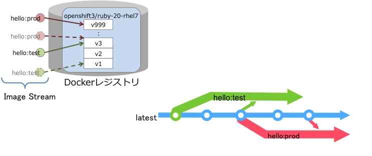
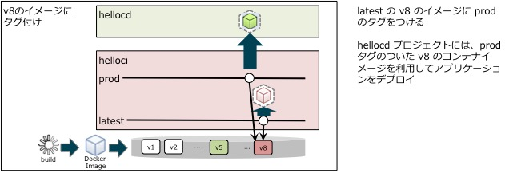

# Continuous delivery


## Container Image
When a container image is created and registered in the repository, the followings are given
* Namespace
* Name
* Tag
* Image metadata


## Image Stream
Image Stream is a reference to a container image.






### Objects that can be referenced
* Container image in the same project that was built with OpenShift Builder
* Other Image Stream
* Docker Image distributed in external Docker Registry

### tag
Label to give to the container image.


## Image Strem management
1. Login to OpenShift at CLI
```
oc login https://<Administration Web URL>
```

2. Select project
```
oc project helloci
```

3. Make a tag for Production  
Give a tag for production to Image Stream of helloci project
```
oc get is
oc tag helloci/world:latest helloci/world: prod
```

## Create a project for production
1. Login to Administration Web  
Access `https://<URL of usage environment>`

2. Create a project  
Click the "New Project" button to start the project creation wizard.

3. Set the project name  
On the "New Project" screen, enter "imageapp" in the Name field and click the "Create" button.

4. Select deployment method  
Select "Deploy Image" on the tab at the top of "Add to Project" screen


5. Select Image Stream  
Specify an Image Stream of `helloci/world:prod` created by the helloci project.  
** the policy setting command is displayed **

6. Policy setting  
Copy the displayed policy setting command and execute it with CLI.
```
oc policy add-role-to-user system:image-puller system:serviceaccount:hellocd:default -n helloci
```

7. Deploy the application  
Click the "Create" button to deploy the application

8. Creating Route  
Create Route by clicking "Create Route" link

## Update application
1. Display the Overview in the management Web
Display the overview of the helloci project so that the reflection of changes can be seen
2. Edit index.php
3. Commit changes

## Update Image Stream
1. Login to OpenShift at CLI  
```
oc login https://<Administration Web URL>
```

2. Select a project  
```
oc project helloci
```

3. Confirm ImageStream  
```
oc get is
oc describe is world
```

4. Display the Overview  
Display the overview of the hellocd project so that reflection of changes can be seen.

5. Make a tag for Production  
Give a tag for production to Image Stream of helloci project.
```
oc get is
oc tag helloci/world:latest helloci/world:prod
```


Http://developerblog.redhat.com/2016/01/13/a-practical-introduction-to-docker-container-terminology/
