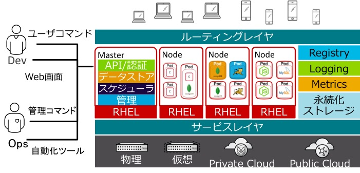
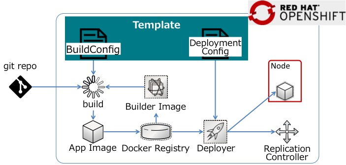
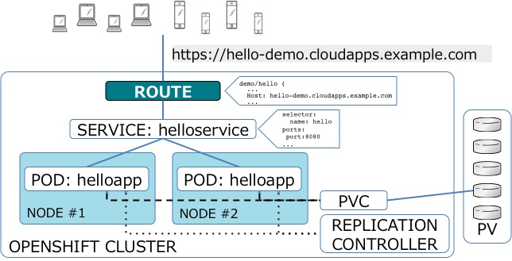

# Basic concept

## infrastructure

## Core object

## Pod
Pod is one or more containers deployed together on one host, and the smallest compute unit that can be defined, deployed, and managed. Same as k8s Pod.  
https://docs.openshift.com/container-platform/3.3/architecture/core_concepts/pods_and_services.html

## Service (svc)
A Kubernetes service serves as an internal load balancer. It identifies a set of replicated pods in order to proxy the connections it receives to them. Same as k8s Service.

## Replication Controller (rc)
Ensure that a specified number of replicas of a pod are running at all times. Same as k8s Replication Controller.  
https://docs.openshift.com/container-platform/3.3/architecture/core_concepts/deployments.html

## Deployment Config (dc)
Define the following details of a deployment:  
- The elements of a ReplicationController definition.
- Triggers for creating a new deployment automatically.
- The strategy for transitioning between deployments.
- Life cycle hooks.  
https://docs.openshift.com/container-platform/3.3/architecture/core_concepts/deployments.html)

## Build Config (bc)
Describes a single build definition and a set of triggers for when a new build should be created.  
https://docs.openshift.com/container-platform/3.3/dev_guide/builds.html#defining-a-buildconfig

## Image Stream (is)
An image stream compirses any number of Docker-formatted container images idenfitifed by tags. It presents a single virtual view of relatd images, similar to an image repository, and my contain images from any of the followings:
1. Its own image repository in OpenShift Container Platform’s integrated registry
2. Other image streams
3. Image repositories from external registries  
https://docs.openshift.com/container-platform/3.3/architecture/core_concepts/builds_and_image_streams.html

## Route
Route exposes a service at a hostaname, like `www.example.com`, so that extenal clients can reach it by name.  
Router enable route created by developers to be used by external client. Technically, OpenShift use HAProxy as router.  
https://docs.openshift.com/container-platform/3.3/architecture/core_concepts/routes.html
